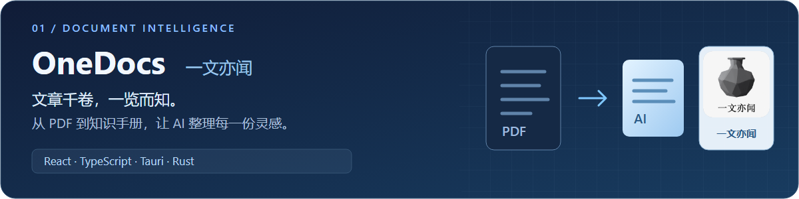
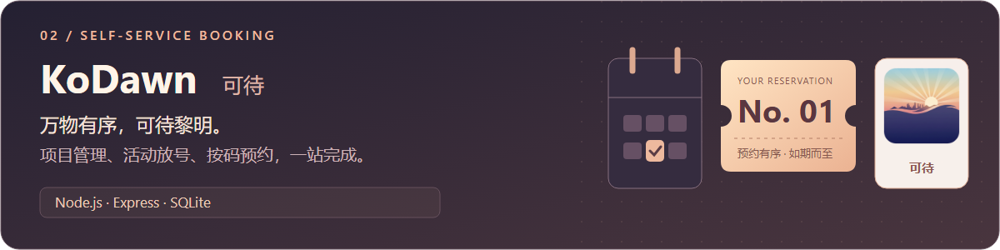
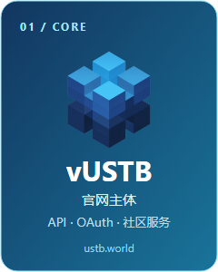
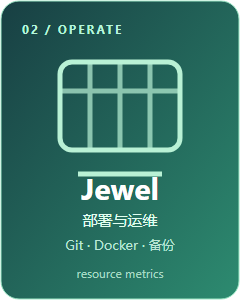
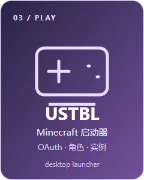
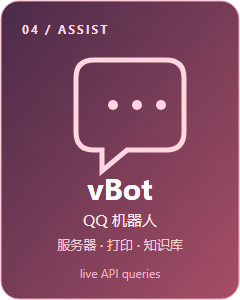
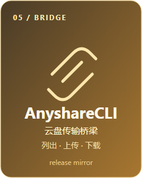
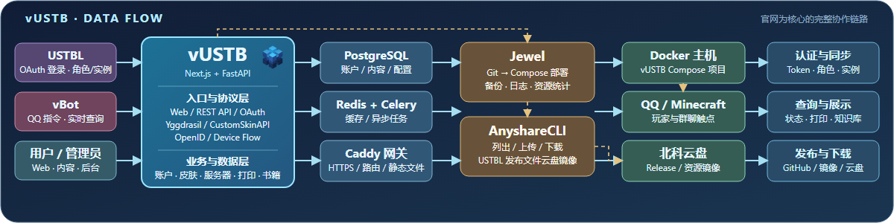

 

<h3>❝ 不为无益之事，何以悦有涯之生 ❞</h3>
<h4>"Time you enjoy wasting is not wasted time."</h4>

 

<table border="0" width="100%">
<tr>
<td width="50%" align="center" valign="top">
<h3>👨‍💻 About Me</h3>

👋 Hi, I’m <b>@LYOfficial</b> 
👀 I’m interested in <b>Minecraft</b> 
📫 Email: LY@tecostudio.cn 
🖥️ <b>Focus:</b> AI, Vincenne Graphs, Image Processing

 
<h3>🏢 Organizations</h3>
&nbsp;
&nbsp;

</td>
<td width="50%" align="center" valign="top">
<h3>🛠️ Tech Stack</h3>

 

 

  
<h3>🎮 Minecraft Player</h3>

 

</td>
</tr>
</table>

 

<table border="0" width="100%">
<tr>
<td width="50%" align="center">

</td>
<td width="50%" align="center">

</td>
</tr>
</table>

 

<h3>🚀 Featured Projects</h3>

<table width="100%" border="0">
<tr>
<td width="50%" valign="top">
<h4>📚 <a href="https://github.com/LYOfficial/OneDocs">OneDocs</a></h4>

基于 AI 的智能文档分析工具：本地解析 PDF，调用多种大模型生成结构化知识手册。

</td>
<td width="50%" valign="top">
<h4>🎟️ <a href="https://github.com/LYOfficial/KoDawn">KoDawn</a></h4>

轻量化自助放号取号系统，覆盖项目、活动、放号员与取号员的完整预约流程。

</td>
</tr>
</table>

<h4>🧱 <a href="https://www.ustb.world/">vUSTB</a> · 像素北科</h4>

<a href="https://www.ustb.world/">官网</a> · <a href="https://github.com/LYOfficial/Jewel">Jewel</a> · <a href="https://github.com/LYOfficial/USTBL">USTBL</a> · <a href="https://github.com/iJunecn/vBot">vBot</a> · <a href="https://github.com/LYOfficial/AnyshareCLI">AnyshareCLI</a> · <a href="./works.md#vustb--像素北科生态">项目说明</a>

 

如蒙**青睐**，烦请**赐星**。

 

If **liked**, please **Star**.

 

